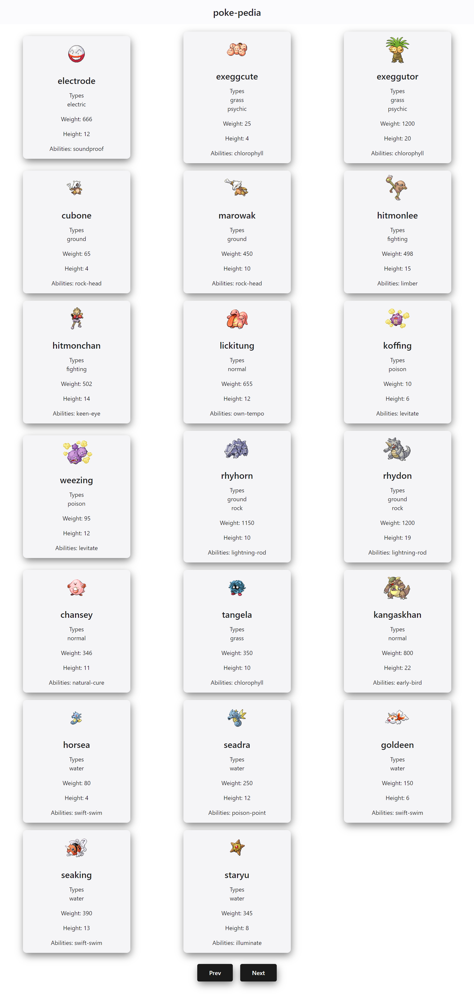

# poke-pedia

**poke-pedia** is an encyclopedia of Pokemon.

It allows you to browse through various Pokemon, providing not only their names and types, but also information such as their height, weight, and key abilities.

The application supports **page navigation** through the use of Prev and Next buttons.

Below is a screenshot of the poke-pedia application.

